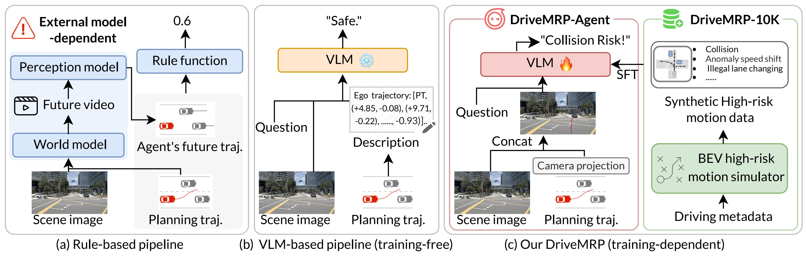
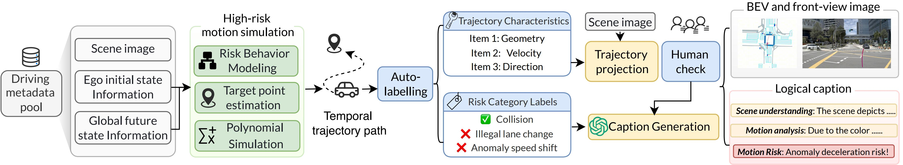
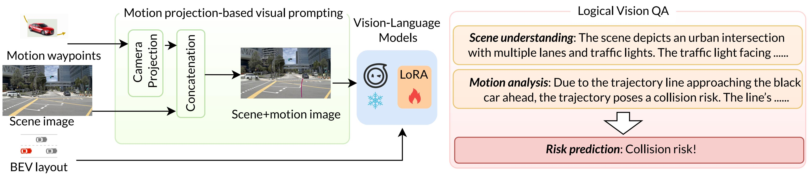
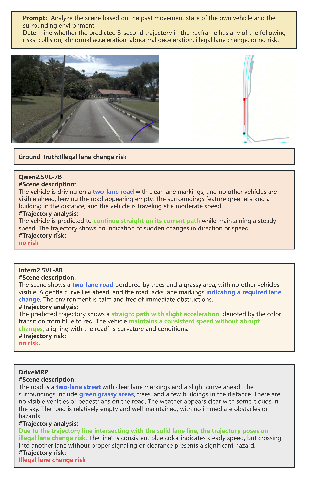
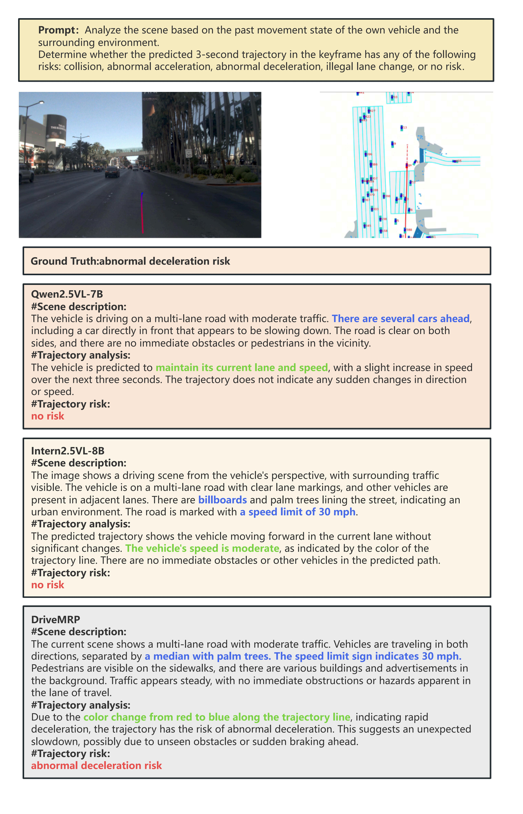
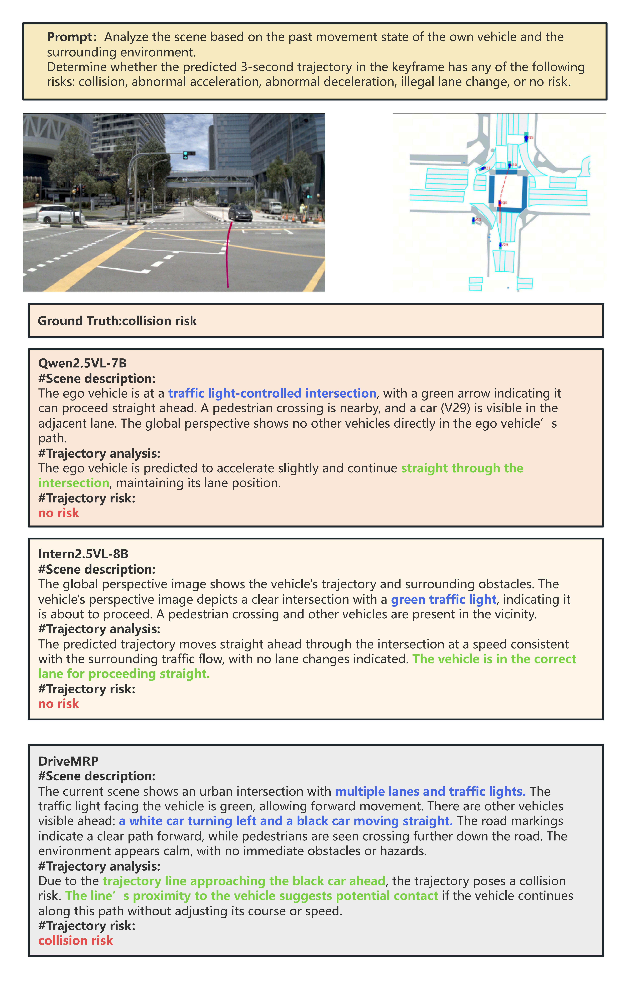

# DriveMRP: Enhancing Vision-Language Models with Synthetic Motion Data for Motion Risk Prediction

## 👥 Authors
**Zhiyi Hou**<sup>1,2,3,*</sup>, **Enhui Ma**<sup>1,3,*</sup>, **Fang Li**<sup>2,*</sup>, Zhiyi Lai<sup>2</sup>, Kalok Ho<sup>2</sup>, Zhanqian Wu<sup>2</sup>,  
Lijun Zhou<sup>2</sup>, Long Chen<sup>2</sup>, Chitian Sun<sup>2</sup>, **Haiyang Sun**<sup>2,†</sup>, Bing Wang<sup>2</sup>,  
Guang Chen<sup>2</sup>, Hangjun Ye<sup>2</sup>, Kaicheng Yu<sup>1,✉</sup>

<sup>1</sup>Westlake University, <sup>2</sup>Xiaomi EV, <sup>3</sup>Zhejiang University  
<small>*Equal contribution between the first three authors. †Project leader. ✉Corresponding author.</small>



## 📌 Table of Contents
- [Abstract](#-abstract)
- [Method Overview](#-method-overview)
- [Dataset Structure](#-dataset-structure)
- [Results](#-results)
- [Citation](#-citation)
- [License](#-license)
- [Acknowledgements](#-acknowledgements)

## 🔍 Abstract
Autonomous driving has seen significant progress, driven by extensive real-world data. However, in long-tail scenarios, accurately predicting the safety of the ego vehicle's future motion remains a major challenge due to uncertainties in dynamic environments and limitations in data coverage. 

In this work, we introduce:
1. **DriveMRP-10K**: A synthetic dataset of high-risk driving motions built from nuPlan using BEV-based simulation to model risks from ego-vehicle, other agents, and environment
2. **DriveMRP-Agent**: A VLM-agnostic framework that incorporates projection-based visual prompting to bridge numerical coordinates and images

By fine-tuning with DriveMRP-10K, our framework significantly improves motion risk prediction performance, with accident recognition accuracy soaring from **27.13% to 88.03%**. When tested via zero-shot evaluation on real-world high-risk motion data, DriveMRP-Agent boosts accuracy from **29.42% to 68.50%**.

## 🧠 Method Overview

### 🗂️ 1. DriveMRP-10K Dataset

- **Synthetic high-risk motion data** generated via BEV-based simulation
- Models risks from three aspects:
  - Ego-vehicle maneuvers
  - Other vehicle interactions
  - Environmental constraints
- Includes:
  - Trajectory generation
  - Human-in-the-loop labeling
  - GPT-4o captions
- **10K multimodal samples** for VLM training

### 🤖 2. DriveMRP-Agent Framework

- VLM-agnostic architecture based on Qwen2.5VL-7B
- Key components:
  - **Projection-based visual prompting**: Bridges numerical coordinates and images
  - **Multi-context integration**: Combines BEV and front-view contexts
  - **Chain-of-thought reasoning**: For motion risk prediction
- Processes:
  1. Global context injection
  2. Ego-vehicle perspective alignment
  3. Trajectory projection

## 🗃️ Dataset Structure

```
DriveMRP-10K/
├── train/                  # Training samples (8,000 scenarios)
│   ├── scenario_001/
│   │   ├── bev.png         # BEV representation
│   │   ├── front_view.png  # Ego-vehicle perspective
│   │   ├── trajectory.json  # Motion trajectory data
│   │   └── caption.txt     # GPT-4o generated description
│   └── ...
├── val/                    # Validation samples (1,000 scenarios)
├── test/                   # Test samples (1,000 scenarios)
└── metadata.json           # Dataset metadata and statistics
```

**Dataset Statistics**:
| Split | Scenarios | Risk Categories |
|-------|-----------|-----------------|
| Train | 8,000     | 4               |
| Val   | 1,000     | 4               |
| Test  | 1,000     | 4               |

**Risk Categories**:
1. Collision risk 🚗💥
2. Emergency acceleration 🚀
3. Emergency braking ✋
4. Illegal lane change ↔️

## 📊 Results

### 1. Performance on Synthetic Dataset (DriveMRP-10K)
| Method | ROUGE-1-F1 | ROUGE-2-F1 | ROUGE-L-F1 | BERTScore | Accuracy | Recall | F1-score |
|--------|------------|------------|------------|-----------|----------|--------|----------|
| EM-VLM4AD-Base | 14.88 | 1.38 | 11.09 | 45.70 | - | - | - |
| Llava-1.5-7B | 42.67 | 11.44 | 27.23 | 65.18 | 22.34 | 1.72 | 0.85 |
| InternVL2-8B | 51.15 | 16.84 | 31.11 | 69.66 | 18.35 | 3.20 | 2.98 |
| InternVL2.5-8B | 49.89 | 15.07 | 29.21 | 68.70 | 26.86 | 9.58 | 4.79 |
| Llama3.2-vision-11B | 23.50 | 7.07 | 15.48 | 57.10 | 11.32 | 1.12 | 0.83 |
| Qwen2.5-VL-7B-Instruct | 48.54 | 15.99 | 30.72 | 68.83 | 27.13 | 13.76 | 6.66 |
| **DriveMRP-Agent (Ours)** | **69.08** | **42.23** | **52.93** | **81.25** | **88.03** | **89.44** | **89.12** |

### 2. Zero-Shot Performance on Real-World Dataset
| Method | ROUGE-1-F1 | ROUGE-2-F1 | ROUGE-L-F1 | BERTScore | Accuracy | Recall | F1-score |
|--------|------------|------------|------------|-----------|----------|--------|----------|
| InternVL2-8B | 52.42 | 18.19 | 32.44 | 70.72 | 22.75 | 13.65 | 9.55 |
| InternVL2.5-8B | 55.14 | 20.58 | 34.45 | 71.87 | 24.28 | 12.18 | 8.34 |
| Qwen2.5-VL-7B-Instruct | 34.36 | 18.58 | 24.83 | 66.50 | 29.42 | 22.06 | 13.61 |
| **DriveMRP-Agent (Ours)** | **62.74** | **30.82** | **42.35** | **76.69** | **68.50** | **51.37** | **56.18** |

### 3. Performance Gains with DriveMRP-10K Fine-tuning
| Method | ROUGE-1-F1 | ROUGE-2-F1 | ROUGE-L-F1 | BERTScore | Accuracy | Recall | F1-score |
|--------|------------|------------|------------|-----------|----------|--------|----------|
| Llava-1.5-7B | 42.67 | 11.44 | 27.23 | 65.18 | 22.34 | 1.72 | 0.85 |
| + DriveMRP-10K | **63.22** | **34.66** | **45.57** | **77.52** | **59.04** | **24.11** | **25.99** |
| Llama3.2-vision-11B | 23.50 | 7.07 | 15.48 | 57.10 | 11.32 | 1.12 | 0.83 |
| + DriveMRP-10K | **52.43** | **33.63** | **36.47** | **70.65** | **56.05** | **22.04** | **23.03** |
| Qwen2.5-VL-7B-Instruct | 48.54 | 15.99 | 30.72 | 68.83 | 27.13 | 13.76 | 6.66 |
| + DriveMRP-10K | **69.08** | **42.23** | **52.93** | **81.25** | **88.03** | **89.44** | **89.12** |


### Qualitative Results
#### Case 1: Illegal Lane Change Risk
[](static/images/case4_00.jpg)
- **Ground truth**: Illegal lane change
- DriveMRP correctly identifies risk while baselines misclassify as "no risk"

#### Case 2: Abnormal Deceleration Risk
[](static/images/case2_00.jpg)
- **Ground truth**: Abnormal deceleration
- DriveMRP detects risk from trajectory color changes

#### Case 3: Collision Risk
[](static/images/case3_00.jpg)
- **Ground truth**: Collision risk
- DriveMRP identifies threat from trajectory proximity to obstacles

### Risk Scenario Videos
| Scenario | Video |
|----------|-------|
| Emergency Acceleration | [acc-1.mp4](static/videos/acc-1.mp4) |
| Emergency Braking | [dec-1.mp4](static/videos/dec-1.mp4) |
| Collision | [col.mp4](static/videos/col.mp4) |
| Illegal Lane Change | [change_lane.mp4](static/videos/change_lane.mp4) |

## 📝 Citation
```bibtex
@inproceedings{hou2025drivemrp,
  title     = {DriveMRP: Enhancing Vision-Language Models with Synthetic Motion Data for Motion Risk Prediction},
  author    = {Hou, Zhiyi and Ma, Enhui and Li, Fang and Lai, Zhiyi and Ho, Kalok and Wu, Zhanqian and Zhou, Lijun and Chen, Long and Sun, Chitian and Sun, Haiyang and Wang, Bing and Chen, Guang and Ye, Hangjun and Yu, Kaicheng},
  year      = {2025}
}
```

## 📜 License
This project is licensed under the [Creative Commons Attribution-ShareAlike 4.0 International License](http://creativecommons.org/licenses/by-sa/4.0/).

## 🙏 Acknowledgements
- This project page template was adapted from the [Academic Project Page Template](https://github.com/eliahuhorwitz/Academic-project-page-template)
- Built upon the [Qwen](https://github.com/QwenLM/Qwen) vision-language models
- Dataset generated using the [nuPlan](https://www.nuscenes.org/nuplan) dataset
- Research supported by Zhejiang University, Westlake University, and Xiaomi EV
